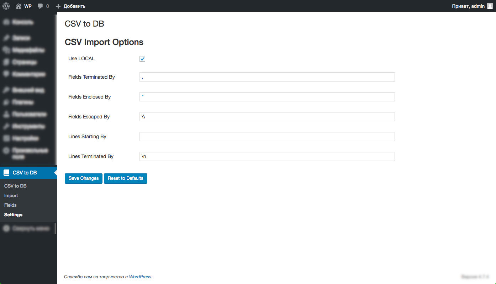
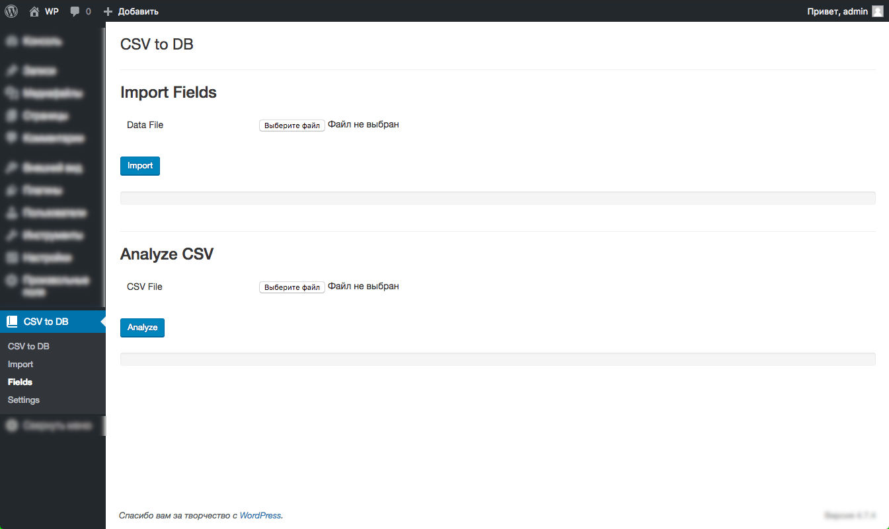
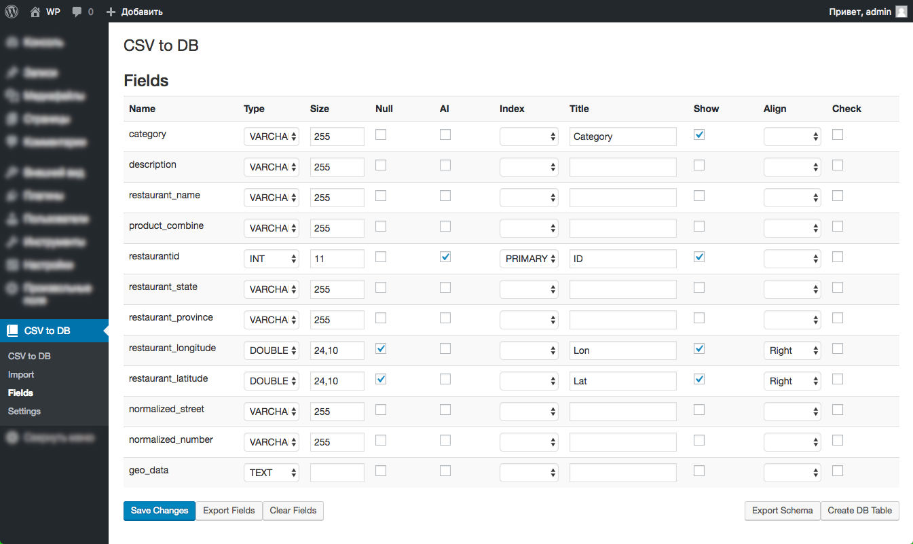
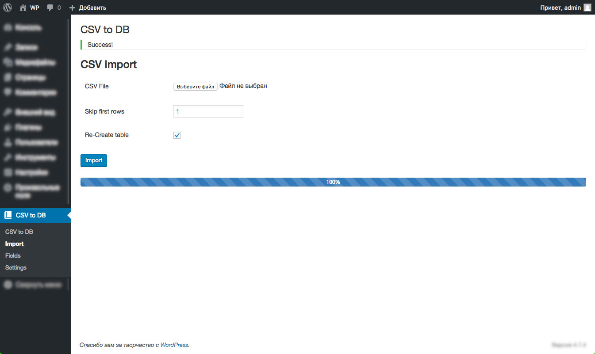

# CSV to DB Manager #

CSV import options

DB schema can be auto-generated from CSV file. Admin can save configuration and later can restore it from file.  

Admin can select the type of fields, define the size, create indexes, labels etc. 

Huge CSV files can be uploaded and processed in seconds.

Bootstrap Table is used to view results.

